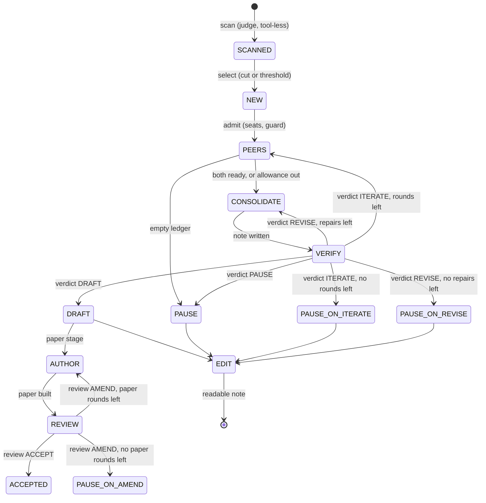

# Pathfinder as a state machine

One pair of papers is one machine. The campaign is a set of these machines
plus a scheduler with a purse. Everything below is what the code does today;
the builder prompt points here for the shape to re-implement.

## Global state of a pair

Position:

- `stage`: where the machine is (see the states below)
- `status`: `running`, `stopped`, `BLOCKED`, or a terminal word
- counters: `round` (research rounds used), `repairs` (note repairs used),
  paper `round`, editor `attempt`

Memory, all files in `threads/<pair>/`:

- `inputs/`: the two papers (flattened TeX or PDF text) and their metadata
- `ledger.jsonl`: append-only, attributed entries (idea, finding, objection,
  correction, intention, ready, review); the peers' shared memory and the
  verifier's evidence
- `ada/`, `emmy/`: each peer's derivations, scripts and checks
- `<pair>.tex`: the consolidated note; `<pair>.verdict.json`: every verdict
  with the digest of the note it judged
- `edited/note.tex`, `references.bib`, `note.pdf`: the readable note
- `paper/paper.tex`, `references.bib`, `paper.pdf`, `search.md`,
  `review.json`: the paper, its search record and every review with the
  digest of the paper it judged
- `status.json`, `paper/paper.json`, `edited/edit.json`: the position

Campaign level: `scan.jsonl`, `shortlist.json`, `receipts.jsonl` (the only
spend figure), `stop.json` and `health.json` (markers), one pid lock per
pair.

## States

Terminal words of the research thread: `DRAFT`, `PAUSE`, `PAUSE-ON-ITERATE`,
`PAUSE-ON-REVISE`. Terminal words of the paper: `ACCEPTED`,
`PAUSE-ON-AMEND`. Every `PAUSE-ON-X` means "the loop named X ran out of its
budget with the judge still asking"; a human can raise the budget and
resume from the recorded stage. `stopped` and `BLOCKED` are not endings:
`stopped` is a drain checkpoint (a stop marker, a transport failure, a
kill) and resumes at the recorded stage; `BLOCKED` is an unreadable
decision or a missing output and needs `reconcile`.

## Transitions

Each transition is one or more model calls. "Sees" is the part of the
global state the agent can read; "writes" is what it may change. Nothing
else is visible or writable, which is what makes the record auditable.

| from | to | agent, prompt, tools | sees | writes | budget |
| --- | --- | --- | --- | --- | --- |
| corpus | SCANNED | judge, `scan.md`, no tools | Q and P titles and abstracts (or full text) | one row of `scan.jsonl` | one call, retried once if unparseable |
| SCANNED | NEW | none (`select`) | all scan rows | `shortlist.json` | none |
| NEW | PEERS | none (runner) | shortlist, statuses, locks, receipts, markers | lock, `status.json` | seats; campaign guard: spend plus in-flight estimate under `budget_usd`, else stop marker |
| PEERS | PEERS | ada and emmy concurrently, `peer.md`, tools and web search | inputs, ledger, own and partner directories, the scan's connexion and scores, this call's allowance | ledger entries (through the helper), own directory | `peer_calls` per peer and `peer_seconds` shared, per round; a peer whose ready stands waits instead of calling |
| PEERS | CONSOLIDATE | none | ledger readiness | `status.json` | reached when both are ready or the allowance is out; empty ledger goes to PAUSE instead |
| CONSOLIDATE | VERIFY | ada, `consolidate.md`, tools | ledger, both directories, the prior note and the verifier's review if any | `<pair>.tex` | `consolidate_seconds`; rerun once unless the note exists |
| VERIFY | next | verifier, `verify.md`, no tools | inputs, ledger, note, all inline | `<pair>.verdict.json`, a review entry in the ledger, `status.json` | `verify_seconds`; rerun once on an empty reply |
| VERIFY | PEERS | verdict ITERATE | | `round` + 1 | `rounds` (4); at the cap ends `PAUSE-ON-ITERATE` |
| VERIFY | CONSOLIDATE | verdict REVISE | the consolidator also sees the review's corrections | `repairs` + 1 | `repairs` (1); at the cap ends `PAUSE-ON-REVISE` |
| DRAFT | REVIEW | author, `author.md`, tools and web search | everything in the thread, the web, the previous review's findings if any | `paper/` | `paper_seconds` per call |
| REVIEW | next | reviewer, `review.md`, no tools | paper, bib, the pipeline's reference checks, the search record, note, ledger, inputs, all inline | `paper/review.json`, `paper.json` | `review_seconds`; `paper_rounds` (3); at the cap ends `PAUSE-ON-AMEND` |
| terminal | EDIT | editor, `editor.md`, tools, no search | inputs and metadata, note, verdicts, ledger, both directories, the pipeline's build and reference checks on retry | `edited/` | `edit_seconds`; two attempts, then `blocked` |

Between transitions the pipeline itself, with no model, does the checks
that gate the next state: builds the LaTeX, verifies citations against the
bibliography and arXiv, records digests, and writes the position. The
verifier's and reviewer's judgements are the only decisions; every other
arrow is mechanical.

## Budgets, and what exhausting them means

| budget | scope | when exhausted |
| --- | --- | --- |
| `peer_calls`, `peer_seconds` | one peer round | consolidate on the ledger as it stands |
| `rounds` | the ITERATE loop | `PAUSE-ON-ITERATE` |
| `repairs` | the REVISE loop | `PAUSE-ON-REVISE` |
| `paper_rounds` | the AMEND loop | `PAUSE-ON-AMEND` |
| editor attempts | the build and reference checks | `blocked` |
| `budget_usd` | the campaign, at admission | stop marker; threads in flight finish; `NEW` pairs wait |

Every model call appends a receipt, so the campaign budget is checked
against the sum of receipts, never against an estimate alone.

## Interrupts

- A stop marker (operator, guard, or first Ctrl-C) stops admission; calls
  in flight land and write their checkpoints; the runner exits; the next
  start resumes each pair at its recorded stage.
- No session within the grace time is a transport failure: no receipt, the
  pair is `stopped`, two in a row set the health marker and pause
  admission until a probe succeeds.
- `reconcile` reads the position of one pair and names the one safe
  action: start, resume peers, run consolidate, run verify, or nothing;
  `--apply` performs it.
